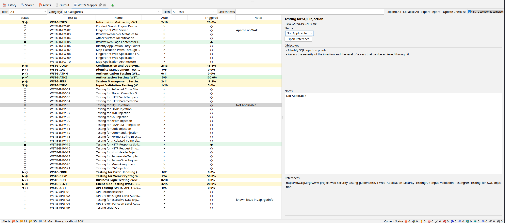
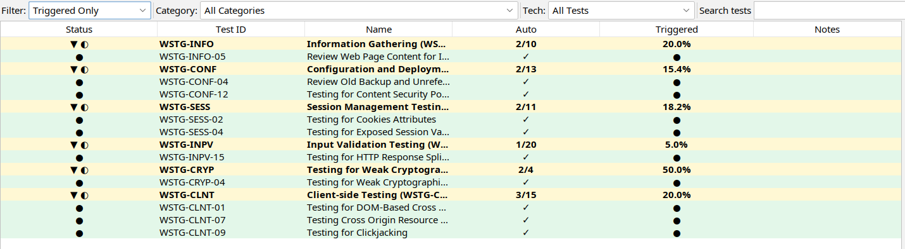
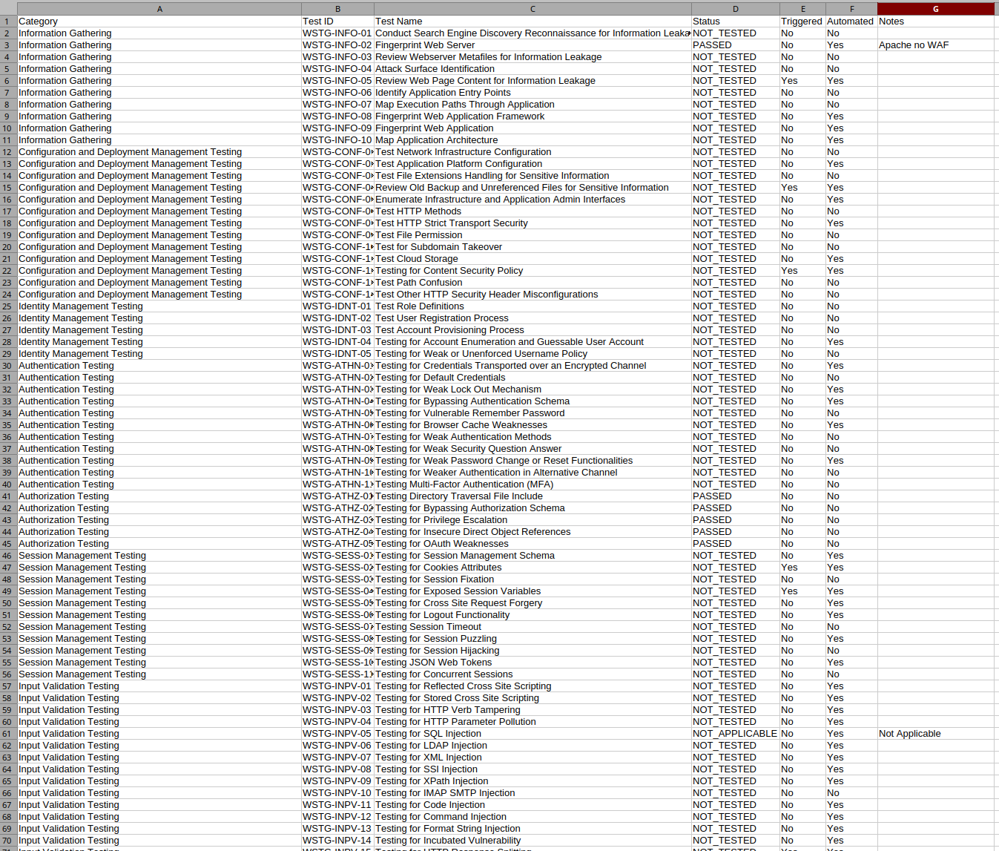

# WSTG Mapper

A ZAP add-on that maps scan results to the [OWASP Web Security Testing Guide (WSTG)](https://owasp.org/www-project-web-security-testing-guide/) and gives testers a persistent compliance dashboard inside ZAP.

## Screenshots


*Full checklist with categories, coverage stats, tech-stack filter, and the detail panel.*

The main dashboard lists every WSTG category and test. Categories show a completion ratio (e.g. `2/10`) and expand on click to reveal individual tests. The right-hand panel shows the selected test's objectives, status, notes, and reference link. The coverage bar at the top tracks overall progress across all categories.


*"Triggered Only" filter showing WSTG tests automatically mapped from ZAP scan alerts, with Auto-detected and Triggered indicators per test.*


*CSV export of the full checklist — includes category, test ID, name, status, auto-detected flag, triggered flag, and tester notes. Ready to open in Excel or any spreadsheet tool.*

## Features

- Full WSTG checklist with all categories and tests
- **Update Checklist** — fetches the latest checklist directly from OWASP GitHub
- Automatic mapping of ZAP alert IDs to WSTG test IDs
- Per-test status: Passed / Failed / Manual Review / Not Applicable / Not Tested
- Notes field per test, persisted with the ZAP session
- Tech-stack detection filter
- Search, category filter, status filter, expand/collapse
- Coverage progress bar
- Export to Markdown and CSV

## Installation

Download the latest `.zap` file from the [releases page](../../releases) and install it via **File → Load Add-on file**.

Requires:
- OWASP ZAP 2.15+
- `commonlib` add-on >= 1.38.0 (available in the ZAP Marketplace)

## Build

```bash
# from the repo root
./gradlew :addOns:wstgmapper:jarZapAddOn
# output: addOns/wstgmapper/build/zapAddOn/bin/wstgmapper-alpha-<version>.zap
```

## Changelog

See [CHANGELOG.md](CHANGELOG.md).
